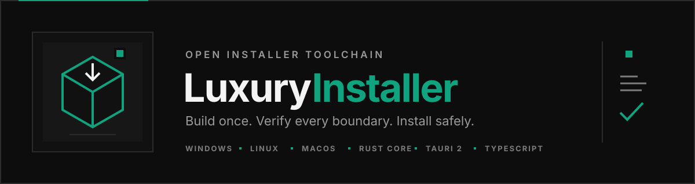

<p align="center">
  
</p>

<p align="center">
  <strong>Security-first installer tooling with a Rust runtime and a compact Tauri desktop.</strong><br>
  Deterministic packages · Transactional changes · Fast, isolated build loops
</p>

<p align="center">
  <code>functional development preview</code>&nbsp;&nbsp;·&nbsp;&nbsp;<code>Rust 1.96</code>&nbsp;&nbsp;·&nbsp;&nbsp;<code>Tauri 2 + React + TypeScript</code>&nbsp;&nbsp;·&nbsp;&nbsp;<code>Windows · Linux · macOS</code>
</p>

<p align="center">
  <a href="#quick-start">Quick start</a> ·
  <a href="#architecture">Architecture</a> ·
  <a href="#security-model">Security</a> ·
  <a href="docs/privileged-helper.md">Privilege boundary</a> ·
  <a href="docs/ai-build.md">AI build guide</a> ·
  <a href="CONTRIBUTING.md">Contributing</a>
</p>

---

Luxury Installer is an open-source, manifest-first installer builder. A project becomes one deterministic `.luxpkg`; the Rust core verifies it and owns installation, upgrade, repair, rollback, removal, receipts, and explicit application launch. Tauri 2 hosts the Codex-style React interface without moving installer policy into TypeScript.

The core workspace and desktop workspace are intentionally separate. A package-policy edit does not compile the desktop graph, while a renderer edit does not rebuild every installer crate.

> [!IMPORTANT]
> **Status: functional development preview, not production-ready.** Package creation, signed package verification, transactional user-scope lifecycle, Studio, bound-payload Setup, unsigned host-native runner assembly, and source-level Windows, Linux, and macOS one-shot system install/uninstall/non-root launch are implemented. Signed-final Windows lifecycle evidence, installed-polkit runtime evidence and Linux distribution signing, signed/notarized macOS runtime evidence, and a downloaded verified release matrix are not complete.

## What works today

| Area | Current capability |
| --- | --- |
| Package | Deterministic gzip/tar `.luxpkg`; unsigned v1, Ed25519-signed v2, authenticated publisher rotation v3, manifest schema v2 entrypoint, schema v3 bounded plain-text license, and optional bounded finish-page details/HTTPS links. |
| Runtime | Read-only preparation with native destination-access and capacity checks; transactional install, update, repair, downgrade policy, rollback/recovery, external ownership receipts, ownership-aware uninstall, explicit receipt-owned launch, and scope-bound private state. All three platforms reuse the same engine through authenticated system helpers. |
| CLI | `init`, `build`, `publisher-key-id`, `prepare-rotation`, `inspect`, `prepare-install`, `install`, `uninstall`, `launch`, and machine-facing `stdio`. |
| Desktop | Tauri 2.11.5 + React 19 + strict TypeScript. Studio creates/opens projects, opens the active folder, revalidates edits, and builds unsigned v1. Setup binds one payload, keeps paths and identity in Rust, renders the lifecycle, requires an explicit `Далее` after successful progress, and obtains pathless system maintenance state through privileged read-only preparation. |
| Boundary | Exact Tauri ACL plus typed invoke/events; a Rust Tauri shell starts `luxury stdio` over bounded JSONL v2 for ordinary work. System scope uses action-separated native transports: Windows named pipes + WinTrust, Linux credential-bound Unix datagrams + polkit, and macOS audit-token seqpacket + SMAppService. The webview never elevates. |
| Native artifacts | `cargo studio-assemble` creates payload-free authoring Studio; `cargo assemble` creates one package-specific unsigned-v1 Setup runner whose release launcher embeds the exact reviewed fingerprint. Both are no-clobber and current-host only; Linux/macOS also receive a deterministic mode-preserving `.tar.gz`. Native Linux can additionally build inspected `.deb`/RPM development packages; native macOS can wrap a verified signed/stapled `.app` in an inspected DMG and verify the externally signed/notarized final image. |
| Build loop | `cargo quick` covers the core workspace only. The standalone `src-tauri` workspace has its own `Cargo.lock`, compact line-table-only dev/test profiles, and a separate desktop gate. |

## Quick start

Prerequisites:

- [Rust via rustup](https://rustup.rs/) — [`rust-toolchain.toml`](rust-toolchain.toml) pins `1.96.0`;
- Node.js `22.12` or newer — [`.node-version`](.node-version) pins the tooling floor;
- pnpm `10.26.2`;
- the [Tauri 2 system prerequisites](https://v2.tauri.app/start/prerequisites/) for your host OS.

Native product floors are Windows 10/11 with WebView2, macOS 13+ for `SMAppService`, and a maintained Linux desktop carrying WebKitGTK 4.1. Windows peer authentication fails closed when `ProcessImageFileMapping` is unavailable; Linux publication remains blocked by the GTK3 advisory described below.

Install desktop dependencies once, then run the two narrow gates:

```console
pnpm --dir apps/luxury-installer install --frozen-lockfile
cargo quick --locked
cargo gui-check
```

Create and build an unsigned project:

```console
cargo run -p luxury -- init <project-dir>
cargo run -p luxury -- build <project-dir> <out.luxpkg>
cargo run -p luxury -- inspect <out.luxpkg>
```

Install unsigned v1 only with explicit consent:

```console
cargo run -p luxury -- install <out.luxpkg> <install-base> <state-root> --allow-unsigned
```

Keep `<state-root>` outside the removable installation tree. The Rust adapter also rejects overlap with its `receipts/`, `transactions/`, and `locks/` namespaces.

### Run the desktop locally

Build the backend, then start Studio:

```console
cargo build -p luxury
pnpm --dir apps/luxury-installer run dev:app
```

Development without a package starts **Studio**. Tauri-owned native dialogs choose project/output paths; renderer actions do not submit filesystem authority.

The authoring loop stays deliberately small: create or open a project, use **Папка проекта** to edit `luxury.toml` and `payload/` with your normal tools, select **Перепроверить**, then build. Reload and reveal are pathless renderer intents; the Rust shell retains the authoritative project path.

Pass exactly one absolute package path after Tauri's runner/application separators to run **Setup**:

```console
pnpm --dir apps/luxury-installer exec tauri dev -- -- --package="<absolute-package.luxpkg>"
```

For signed v2/v3 QA, also pass `--trusted-publisher-key="<absolute-public.pem>"`. `LUXURY_BACKEND_PATH` may select another absolute local backend in debug builds. Packaged Setup ignores these debug-only overrides and reads its single payload from the fixed native resource location. It never offers a package picker or drag-and-drop.

### Signed packages

Signing commands accept private keys only as bounded 16 KiB stdin, never as a CLI value, JSONL field, environment value, log, or project file:

```console
# signed v2
<private-key-provider> | cargo run -p luxury -- build <project-dir> <out-v2.luxpkg> --signing-key-stdin

# inspect with the external signer trust anchor
cargo run -p luxury -- inspect <out-v2.luxpkg> --trusted-publisher-key <public.pem>
```

Authenticated A→B rotation is a separate v3 flow:

```console
cargo run -p luxury -- publisher-key-id <current-a-public.pem>
<next-b-key-provider> | cargo run -p luxury -- prepare-rotation <package-id> <version> <current-a-key-id> --next-signing-key-stdin
<current-a-key-provider> | cargo run -p luxury -- build <project-dir> <out-v3.luxpkg> --signing-key-stdin
```

A and B private keys never enter one process. A later B-signed package still requires B through an external trusted channel.

### License agreements

Manifest schema v3 may embed one bounded plain-text agreement inside the authenticated manifest:

```toml
format_version = 1
schema_version = 3

[package]
id = "dev.luxury.demo"
name = "Luxury Demo"
version = "1.0.0"
publisher = "Luxury Software"
license = """
Demo license terms.
"""
```

`luxury inspect` prints the exact text. Human CLI installation then requires `--accept-license`; Setup shows a separate keyboard-scrollable agreement screen. Rust rejects missing consent before package verification or any platform mutation. The text is limited to 16,384 Unicode characters / 64 KiB UTF-8 and rejects unsafe control and bidi-override characters.

### Installation details and finish links

The package author may opt into a bounded, read-only details panel and add up to four finish-page links:

```toml
[install]
scope = "user"
directory = "Luxury Demo"
show_install_log = true

[[install.finish_links]]
label = "Документация"
url = "https://example.com/docs"

[[install.finish_links]]
label = "Поддержка"
url = "https://example.com/support"
```

`show_install_log` defaults to `false`; an omitted `finish_links` list is empty. The details panel shows the factual destination, aggregate result, at most 128 authenticated manifest paths, and an omitted-file count. It is not a raw backend log and cannot expose package paths, fingerprints, receipts, or privileged system roots.

Finish links accept only bounded HTTPS URLs without credentials. The renderer submits only a validated list index to the Rust shell; Rust retains the authenticated URL and opens it natively only after a successful installation. Arbitrary commands, URL schemes, arguments, environment changes, and automatic launch remain unsupported. `install.entrypoint` continues to be the only way to offer the receipt-owned **Запустить** action.

## Choose the smallest useful gate

| Command | Purpose |
| --- | --- |
| `cargo test -p <crate>` | One changed Rust crate or vertical slice. |
| `cargo quick --locked` | Default core loop: product crates, CLI, and `xtask`; no Tauri workspace. |
| `cargo core-check` | Type-check the core workspace without tests. |
| `cargo gui-check` | Renderer contracts, strict TypeScript, Vite production build, and locked standalone Tauri check. |
| `cargo tauri-test` | Standalone Tauri Rust tests after shell/transport changes. |
| `cargo tauri-clippy` | Standalone Tauri all-target Clippy with warnings denied. |
| `cargo ci` | Formatting, one locked core gate, then the isolated desktop gate. |
| `cargo full-test --locked` | Broad core workspace/all-target release-candidate gate. |
| `cargo dist` | Full core tests plus host backend and checked desktop frontend; no distributable or signing claim. |
| `cargo studio-assemble` | Build and verify one payload-free portable authoring Studio for the current host; Unix also publishes its deterministic `.tar.gz`. |
| `cargo runner-smoke` | Host-native packaged recovery/cancellation/launch/lifecycle gates, Tauri entrypoint verification, cleanup, then local evidence schema v2. |
| `cargo linux-packages -- <package.luxpkg>` | On native Linux, create and inspect unsigned `.deb` and RPM development packages from one verified bound Setup. |
| `cargo macos-dmg -- <signed.app>` | On native macOS, wrap one exact signed/stapled Setup app in an inspected unsigned development DMG. |
| `cargo verify-macos-dmg -- <signed.dmg>` | Require an exact signed, Gatekeeper-accepted, stapled DMG and reverify the mounted Setup app. |
| `cargo verify-windows-signers -- <launcher.exe> <helper.exe>` | Require two embedded Authenticode chains and the exact same leaf certificate; unsigned, catalog-only, invalid, or different signers fail. |
| `cargo windows-release-setup -- <signed-runner-dir> <nsis.zip>` | Verify the same-signer inner launcher/backend and emit the unsigned outer NSIS container for external signing. |
| `cargo verify-windows-release -- <signed-setup.exe>` | Verify the final signed NSIS parent, signer-bound inner runner/helper, UAC transport, and argument rejection. |

Do not repeat broad gates without a code change or new evidence. A green host run proves that host only.

## Host-native assembly

Build the payload-free authoring application for the current host:

```console
cargo studio-assemble
```

Studio uses the default `studio` Cargo feature, carries only the exact Rust backend, and must pass windowless `--verify-studio`. It contains no payload or trust resource.

Linux and macOS assembly also publishes a deterministic no-clobber `<artifact>.tar.gz`. Rust rejects links/special files and opened-file identity/mode drift, normalizes directories and executables to `0755`, data to `0644`, UID/GID and timestamps to zero, and syncs before publication. CI uploads this archive instead of the raw directory because generic artifact transport does not preserve Unix executable bits. Linux additionally binds a byte-identical backend copy at `usr/libexec/luxury-installer-helper` and the reviewed polkit policy. macOS binds a byte-identical helper, the branded `icon.icns`, its exact `Contents/Library/LaunchDaemons` plist, and a macOS 13 deployment floor; `Info.plist` declares the same icon. Linux system scope remains disabled until root installation; macOS remains disabled until app/helper designated requirements and notarization are valid. This preserves transport semantics; it is not native signing or a defense against hostile same-user parent-path ABA.

Build one unsigned-v1 development runner for the current OS and architecture:

```console
cargo assemble -- <absolute-package.luxpkg>
```

Setup assembly uses the mutually exclusive `setup` feature, fresh staging, the standalone locked Tauri workspace, the checked frontend, the dist Rust backend, and one fixed payload. It verifies copied hashes and package identity, runs windowless `--verify-runner`, publishes under ignored `dist/`, refuses to overwrite an existing artifact, and emits the same mode-preserving archive on Linux/macOS.

The command does not cross-compile, sign, notarize, or prove another OS. Signed v2/v3 runner assembly remains fail-closed because a public key stored inside the same unsigned mutable container is not a trust anchor.

On native Linux, package the verified bound Setup with the already-pinned Tauri bundler:

```console
cargo linux-packages -- <absolute-package.luxpkg>
```

The gate requires `dpkg-deb`, `rpm`, `rpm2cpio`, and `cpio` for independent inspection. It rejects extra paths, links, special files, non-root ownership, wrong modes, scripts, dependency drift, altered launcher/backend/payload/helper/policy/icon bytes, or a desktop entry that accepts arguments. It publishes no-clobber `.deb`, RPM, and path-free provenance under `target/linux-packages/`. These packages are explicitly unsigned, non-reproducibility-claimed development artifacts; distribution signing, native installed-polkit lifecycle evidence, and the GTK3 advisory remain release blockers.

On Windows, a pinned NSIS archive can wrap the verified runner in an unsigned development `Setup.exe`:

```console
cargo windows-setup -- <absolute-package.luxpkg> <absolute-nsis-3.12.zip>
```

This is a development container, not an Authenticode-signed release.

### Windows release signing order

Windows release signing is deliberately two-phase; signing only the outer `Setup.exe` is insufficient.

1. Build the bound Windows runner and externally Authenticode-sign both `Luxury Installer.exe` and `backend/luxury.exe` with the same leaf certificate.
2. Verify that inner pair, then build the outer container:

   ```console
   cargo verify-windows-signers -- <signed-runner-dir/"Luxury Installer.exe"> <signed-runner-dir/backend/luxury.exe>
   cargo windows-release-setup -- <signed-runner-dir> <absolute-nsis-3.12.zip>
   ```

3. Externally Authenticode-sign the emitted `LuxuryInstallerSetup.exe` with that same certificate.
4. Verify the exact final bytes on native Windows x86_64:

   ```console
   cargo verify-windows-release -- <signed-LuxuryInstallerSetup.exe>
   ```

The final gate binds the signed NSIS parent to the signed Tauri launcher and elevated Rust helper, exercises the authenticated container-parent path, and rejects unexpected arguments. Before authenticated UAC launch, Tauri pins the exact helper pathname, compares its embedded signer with the process-image-bound signer of the running launcher, and retains the guard through `ShellExecuteExW`. Signing credentials stay entirely outside this repository and every Rust command.

On macOS, verify the final signed and notarized `.app` on the native host:

```console
LUXURY_APPLE_TEAM_ID=XXXXXXXXXX cargo verify-macos-release -- <signed-app.bundle>
```

The gate requires matching app/helper designated requirements, strict nested code validation, Gatekeeper acceptance, and a stapled notarization ticket. It verifies; it does not own signing credentials.

Create the drag-to-Applications image only from that verified app:

```console
LUXURY_APPLE_TEAM_ID=XXXXXXXXXX cargo macos-dmg -- <signed-stapled.app>
```

Rust uses native `ditto`/`hdiutil`, mounts the image read-only, requires exactly `Luxury Installer.app` plus an `/Applications` link, and reverifies signatures, notarization, package identity, windowless Tauri entrypoint, modes, branding, helper plist, and all critical hashes. The generated image is intentionally unsigned development output. Sign and notarize the DMG externally, staple it, then run:

```console
LUXURY_APPLE_TEAM_ID=XXXXXXXXXX cargo verify-macos-dmg -- <signed-notarized.dmg>
```

The final gate checks the DMG signature, Gatekeeper `open` assessment, stapled ticket, image integrity, exact mounted layout, and the embedded app again. Neither command reads signing credentials.

### Evidence schema v2

`cargo runner-smoke` writes `target/runner-evidence/<os>-<arch>.json` only after its disposable tree is removed. Schema v2 records:

- target triple, OS, and architecture;
- `tauri` shell kind and pinned version;
- package identity and fingerprint;
- SHA-256 of backend, payload, frontend tree, and launcher;
- normal lifecycle counts and explicit backend/install/uninstall/cleanup/Tauri-entrypoint checks.

The JSON is path-free, timestamp-free, and unsigned. It is a deterministic verification receipt, not provenance attestation or native signing. License-denial/no-roots, recovery, cancellation, and receipt-owned launch gate evidence publication but are not encoded as schema-v2 fields.

Routine pull-request/main CI keeps format, quick, desktop, and a focused Windows `luxury-windows-trust + luxury-platform` boundary job separate. The manual CI matrix builds and probes Studio, creates and inspects unsigned `.deb`/RPM development packages on Linux, then runs Setup lifecycle smoke natively on Linux, Windows, and macOS x86_64 and requires exactly the three expected evidence files. Workflow configuration alone is not proof that the matrix has run; downloaded artifacts are the evidence.

## Architecture

```text
React + strict TypeScript
        │ allowlisted Tauri invoke/events
        ▼
Tauri 2 Rust shell ── native dialogs, bound paths, lifecycle, public errors
        │ bounded typed JSONL v2 over stdin/stdout
        ▼
luxury stdio ── Rust composition root
        │
        ├── luxury-engine ── use cases and ports
        ├── luxury-platform ── filesystem and OS mutations
        ├── luxury-bundle ── package trust boundary
        ├── luxury-compiler ── safe project/package assembly
        └── luxury-spec ── platform-neutral validated values
```

| Component | Owns |
| --- | --- |
| `luxury-spec` | Stable schema, validated values, portable invariants; no filesystem/archive/GUI/OS API. |
| `luxury-bundle` | Deterministic archive layout, object hashes, and package verification. |
| `luxury-engine` | Install/uninstall/launch use cases, events, outcomes, and ports. |
| `luxury-platform` | Real filesystem and OS mutations, state, recovery, and native launch. |
| `luxury-compiler` | Safe project scanning and `.luxpkg` assembly. |
| `luxury` | Human CLI and `luxury stdio`. |
| `src-tauri` | Rust desktop composition boundary and exact renderer capability surface. |
| React renderer | Presentation and accessibility only. |
| `xtask` | Focused gates, host-native assembly, smoke orchestration, and evidence validation. |

New behavior lands as the smallest complete slice: **spec → use case → adapter → CLI/GUI**. Read [docs/architecture.md](docs/architecture.md) for the complete boundary contract and [docs/design/design-system.md](docs/design/design-system.md) for the implemented visual language.

## Security model

```text
verify → preflight → lock → journal → stage+sync → backup/atomic publish → receipt → commit
                                      └────────── rollback on error/cancel
```

- Package manifests, archive entries, paths, hashes, JSONL, renderer messages, receipts, and journals are untrusted.
- Portable paths reject absolute/parent/UNC/device/ADS forms, links, special entries, and ambiguous aliases.
- Setup keeps package path/fingerprint, state root, install base, and entrypoint path inside the Rust shell; renderer sends pathless intent and explicit consent only.
- The exact Tauri capability file grants event listen/unlisten, window dragging, and named application commands. Renderer receives no generic shell, filesystem, dialog, opener, or process capability.
- Production CSP is local-only and contains no inline-script or inline-style exception; Vite loopback/WebSocket and inline development styles exist only in `devCsp`.
- Mutations are journaled and paired with rollback; ownership receipts live outside the installed tree.
- Uninstall removes only unchanged owned files and preserves unknown or modified data.
- Launch is explicit, receipt-owned, argument-free, and direct: no shell, package-controlled environment, automatic run, or inherited protocol streams.
- Human logs go to stderr. Protocol stdout contains JSONL frames only.
- License consent is a Rust-checked boolean bound to the currently inspected package; the renderer cannot replace the signed text or start a licensed install without sending acceptance.

Known ceilings remain release blockers: signed-final Windows system lifecycle; installed and distribution-signed Linux polkit lifecycle; signed/notarized native macOS lifecycle and real SMAppService/launchctl proof; Windows pathname/reparse parent binding and general directory durability; Unix pre-open/source-leaf ABA; hostile same-user mapped-writer races; native macOS/APFS and VM power-cut proof; signed native containers and published signature/recovery matrices. Linux desktop publication is additionally blocked by the current Tauri/Wry GTK3 graph carrying `glib 0.18.5` (`RUSTSEC-2024-0429`); the latest published Wry still depends on GTK3 `0.18`, while the advisory is fixed in `glib >=0.20`. Do not claim power-loss safety, hostile-local-user isolation, or production readiness from current tests.

The desktop bootstrap refuses to create a webview when its process is already elevated; windowless `--verify-*` probes remain allowed. On Windows those probes require a live one-shot named-pipe handshake with the exact packaged backend and mutual kernel-reported PID binding. Before authenticated `runas`, Tauri pins the exact single-link non-reparse helper without write/delete sharing and compares its embedded signer with the process-image-bound signer of the running launcher. The guard survives `ShellExecuteExW`; after launch, each reported pathname is independently opened and bound to the real running image through `ProcessImageFileMapping` before WinTrust. Replacing the old pathname cannot substitute another signer. Explicit manual QA may append `--verify-elevated-transport` for the pinned UAC/token transport or `--verify-authenticated-transport` for embedded WinTrust chains plus exact leaf-certificate equality. Current development artifacts are unsigned, so the authenticated probe must exit nonzero. Release Setup additionally embeds and checks its exact package review fingerprint. Action-bound system prepare/install/uninstall/launch requests carry no path, key, root or entrypoint: each duplicates a pinned package handle from the authenticated parent, independently checks exact ID/fingerprint/host/system scope, derives OS roots, and executes the Rust engine. Launch validates the private receipt and executable under helper authority but creates the child with the checked unelevated Tauri token. All normal CLI/stdio constructors remain user-only; signed-final runtime proof remains open.

Read [SECURITY.md](SECURITY.md) before testing hostile packages. Report exploit details through private vulnerability reporting.

## Contributing

Start with [CONTRIBUTING.md](CONTRIBUTING.md), then read [AGENTS.md](AGENTS.md), [MEMORY.md](MEMORY.md), and [docs/ai-build.md](docs/ai-build.md). Preserve unrelated work, keep one vertical slice per change, and run the smallest gate that can disprove it.

Never commit signing keys, certificates, tokens, built payloads, `target/`, `node_modules/`, frontend `out/`, or temporary QA artifacts.

Questions belong in [Discussions](https://github.com/GofMan5/luxury-installer/discussions); reproducible defects use the issue forms. See [SUPPORT.md](SUPPORT.md), [CHANGELOG.md](CHANGELOG.md), and [CODE_OF_CONDUCT.md](CODE_OF_CONDUCT.md) before participating.

## License

Licensed under either [Apache License 2.0](LICENSE-APACHE) or [MIT](LICENSE-MIT), at your option.
